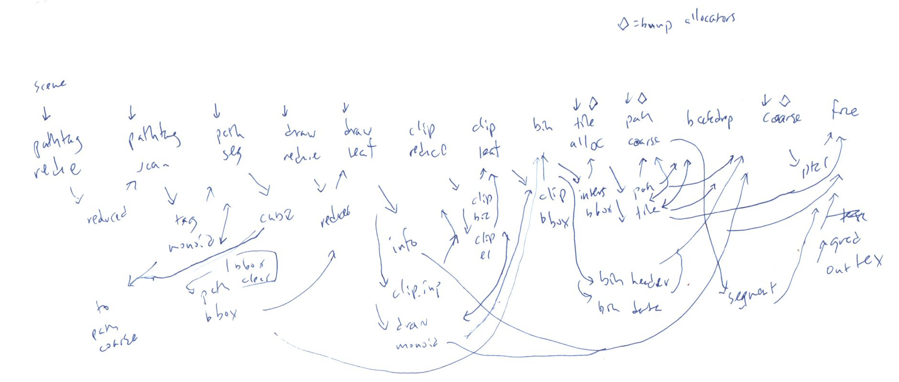

# Roadmap for 2023

Vello is a GPU accelerated 2D rendering engine, with ambitious goals to deliver efficient and high quality rendering by using compute shaders effectively. Last year saw progress on many fronts, including implementations of gradients, moving the clip stack processing to GPU, blends with almost arbitrarily deep nesting, and advances in the efficiency of scene encoding both to generate CPU-side and to process GPU-side. We also did a rewrite into WGSL, which we expect will improve collaboration with the rest of the ecosystem. This work has been fruitful research. In 2023, we plan to build on that research and ship a renderer that can be used in a variety of applications including GUI rendering, creative applications, and potentially 2D games and scientific visualization.

Late last year, we also renamed the project from piet-gpu, as it's no longer based on the Piet API (which had a number limitations including not supporting multi-threaded encoding). Vello, the new name, suggests both vellum (as used in illuminated manuscripts) and velocity.

The core team – Raph Levien and Chad Brokaw, with help from Arman Uguray – will be able to do most of the tasks listed here. Help from the community could speed things up or add even more features. We also rely heavily on the wgpu community to build solid GPU infrastructure for our uses, and also expect a nontrivial amount of integration work as people adopt Vello for their projects.

Large parts of the [piet-gpu vision] are still valid, but of course there are updates in the two years since it was written.

This roadmap is in roughly chronological in order of when we expect to complete the work. For each bullet point in the outline

* Completing the basic imaging model, to handle the needs of real applications.
* CPU fallback implementation, for better compatibility, testing, and debuggability.
* Stroke rework, to correctly and efficiently render the diversity of stroke styles.
* A writeup, so people can better understand and evaluate the project.
* Glyph caching, for higher performance for UI applications.
* Blurs and filter effects, as they are an important imaging primitive.
* A semi-stable encoding format, to offer more flexibility in getting scenes into the engine.

In addition, there are a few optional aspects to the roadmap, which will be implemented if there is demand from users or motivation from contributors:

* Native renderering back-ends, to reduce the overhead of WebGPU, especially runtime shader compilation.
* A solution to conflation artifacts, to improve rendering quality for some classes of vector art.
* Subpixel RGB rendering, to improve rendering quality on low-dpi LCD screens.
* High Dynamic Range (HDR) rendering, to exploit capabilities of new displays.

## Completing a basic imaging model

A 2D renderer needs to support at least a basic imaging model. The biggest single thing missing from Vello right now is images; without those, it is unsuitable for many applications.

Supporting images *well* is tricky, in large part because of limitations in GPU infrastructure. The number of images that may appear in a scene is not bounded, which is not a good fit for the basic descriptor binding model. Ideally a single shader (the fine rasterization stage) can sample from all the images in the scene directly, but that's not really possible in WebGPU 1.0. Perhaps a future extension will have version of this; in Vulkan it's descriptor indexing (and [buffer device address] and [descriptor buffer], as GPU approaches to this problem keep evolving, but it's less likely the latter will be standardized in WebGPU, as they're basically variants of raw pointers and thus extremely difficult to make safe).

Until then, we'll do a workaround of having a single atlas image containing all the images in the scene. That has nontrivial cost in memory allocation and bandwidth for texture copying, and the logic is tricky to write robustly, but the impact of copying on total rendering time is not expected to be that bad. And in the common case where an image is reused across multiple frames, it should in most cases be possible to avoid those copies.

One tricky part is changes to the scene encoding. At the moment, it's more or less self-contained, but will need to be extended so that scene fragments can contain references to image resources (which will be a reference counted pointer to either the image bytes or to an external image reference, which might be rendered by some other WebGPU task). Additionally, there needs to be an additional pass between encoding and submission to the GPU, where references to these resources are replaced by uv quads in the texture atlas. Similar logic is needed to resolve cached glyphs, about which more below.

Direct support for rectangles is also included in the "basic imaging model" category even though it's technically just an optimization, because it's important to get right architecturally. Right now, every draw object has an associated Bézier path, but that is going to be a performance problem when draw objects are images (or basically anything other than a vector path). Also, rectangles are important in UI, so it makes sense for drawing to be fast.

The last thing that belongs in "basic imaging model" is a proper API for glyph runs. At the moment, text is basically encoded as filled vector paths, but that doesn't scale to supporting glyph caching (about which more below). This is about getting the API right so clients won't be locked into fully dynamic vector text rendering.

* [vello#176]\: Image resources
* [vello#187]\: Rectangles
* TODO: no issue yet for the glyph run API

## CPU fallback implementation

Vello primarily runs in GPU compute shader stages, but there are three motivations for also having a CPU fallback path.

The most important reason is to improve testing and debuggability. At the moment, we have two or three cases where there are artifacts or missing objects, but only in certain configurations. The systematic approach to this problem is to have a CPU implementation of each compute stage, and then the CPU and GPU outputs can be compared. Other problems might be isolated by swapping out one implementation for another.

In addition, in some cases a competent GPU won't be available, or perhaps it is on a denylist because of known bugs. In that case, a CPU implementation is necessary in order to display anything.

Lastly, because of various overhead, GPU dispatch is only efficient when working with large datasets. When rendering an extremely simple scene, it might be more efficient just to do the compute work on CPU, and save the GPU dispatch. Generally you'll still want to do fine rasterization (production of actual pixels) on GPU, as even if the CPU could do that really quickly there would still be the cost of getting them uploaded.

Because of the emphasis on testing, at least the initial CPU implementations will be optimized for clarity and simplicity, not so much performance. It is possible to imagine doing SIMD optimization and running the work on multiple threads, but that is not planned (see non-goals below).

## Stroke rework

The current stroke implementation is based on distance fields, and is appealing in some ways (GPUs are good at distance field rendering). However, it also has some limitations and we plan to rework it.

The limitations include:
* Only doing round styles for stroke join and cap (not miter etc)
* Not drawing with an elliptical pen when affine transformed
* Quality issues on [very thin strokes]
* No clear, good solution to [stem darkening]

These limitations motivated work in analytically computing offset curves. We explored a [cubic-to-cubic approach][Parallel curves of cubic Béziers] but ultimately concluded that it wasn't suitable for GPU implementation, as there are numeric robustness issues with using f32's for quartic root-finding, and also it's tricky to find and handle the cusps.

A better approach is to combine offset and flattening in one operation. See [Fast approaches to simplify and offset Bézier curves within specified error limits] for a detailed exploration, which describes the techniques used in Blend2D.

At the moment, the most promising approach is to convert cubic Béziers (and possibly other source curves, potentially including the rational Béziers that would result from perspective transformation) into Euler spirals, derive the [parallel curve][Cleaner parallel curves with Euler spirals] as an Euler-to-Euler transformation, then flatten those using [similar techniques][Flattening quadratic Béziers] as is done today, just with Euler spirals instead of quadratic Béziers. This is prototyped and the results are encouraging, and it seems likely all this can be adapted to running efficiently in a compute shader. Another compute shader would handle corners.

The result would be a transformation of the stroke into a filled path, tiled into path segments. This is thus a simplification of fine rasterization, as it no longer needs to handle strokes and fills separately, but can just treat everything as a filled path. Another benefit is that the same mechanism can apply stroke thickening to glyphs while retaining very high quality.

## Writeup

We often hear that the Vello design is intimidating, that it seems too much like rocket science and that it is hard to contribute to the code. There are many advanced ideas, including extensive use of prefix sum techniques (including the [stack monoid]), sophisticated math for curves and 2D geometry (see above), clever binary encoding techniques, and quite a bit of work to adapt to the tricky requirements of portable GPU compute shaders. While it draws extensively from published work, it is not a straightforward extension of any existing system.

Such work deserves a good writeup. The current plan is to write an approximately 20 to 30 page report that explains all important aspects of the design, how they fit together, and enough empirical performance measurement that people can make good decisions based on it. It's always tricky to know *when* to invest in a writeup, especially as we keep iterating on the design itself, but this seems like a good place in the roadmap.

A central part of the writeup is a good visual diagram of the entire pipeline. The below hand-drawn diagram shows the main shader stages and buffers. With nice color coding and a more professional appearance, it could be a great tool to help explain the structure of the system. (In this diagram, the shader stages are green, and the buffers are dark blue; it is obviously a rough draft)

We hope that such a writeup will help people contribute to the code, adapt the design to their own requirements as needed, and generally advance the cause of GPU compute, particularly WebGPU.

## Glyph caching

Most GPUs should be able to handle a UI scene with fully dynamically rendered text at full frame rate, but it is more efficient to cache the glyphs rather than re-rendering them each frame. That will especially help on very low-spec GPUs (especially mobile phone which have high display dpi relative to available computing resources), but should also help especially with power even on more powerful devices.

In addition, on low-dpi displays there is a quality improvement to be gained by doing hinting, and that also strengthens the case for caching the result of rendering.

Thus, we plan to implement glyph caching and a texture atlas for these rendered glyphs. See the linked issue below for more detail.

* [vello#204]\: Plan for glyph rendering

## Blurs and filter effects

Many rendering effects, including gradients, blending, and soft masks, can be computed on a per-pixel basis. However, some popular image filtering techniques, especially blurs, require rendering a complete scene fragment to an image, then applying the image filter to that rendered image.

Supporting this requires two major changes to the architecture. First, it must be possible to render to multiple texture targets, and for efficiency this work must be done in parallel. (As a side note, the [Deep dive into Nanite] talk did a great job explaining a similar issue with the need to render multiple shadow targets, and we take inspiration). Second, at least the fine rasterization stages need to be stitched together with these image filters into a *render graph* which is now dynamic based on the structure of the overall scene graph. Fortunately, such render graphs are standard and well understood in the GPU rendering world.

An appealing special case is [blurred rounded rectangles]. For those, it's practical to compute a very close approximation as effectively a fragment shader, meaning there's no need to actually render the underlying rounded rectangle or perform filter operations on it. That will be fun to refine and adapt to compute shaders.

## Semi-stable encoding format

The scene encoding format is one of the more interesting aspects of Vello, and in recent months our thinking has evolved considerably. Previously we've considered it an internal detail, an opaque format exposed only through a canvas-like API. The previous API was based on the Piet `RenderContext` trait, and moving away from that is a main reason we changed the name of the project. The current state is a "scene fragment" API, specifically so that fragments can be built in multiple threads and then efficiently assembled into a scene. We are excited about exploring the possibilities of making UI rendering multithreaded based on that approach. The [High Performance Rust UI] explains these goals and motivations in more detail.

Taking that idea to the next step, we can make the scene encoding format part of the public interface, so that clients can use a diverse variety of techniques to create and manipulate encoded scenes. That might include more direct encoding from some other format or API, special requirements like mutating just a small number of parameters in an already encoded scene (for example, to fade alpha or animate a transformation), lerping the coordinates of vector paths, and other things. It's also interesting to think about creating encoded scenes GPU-side, perhaps to drive a scientific visualization.

Another potential reason to make the encoding part of the interface is so assets can be stored in encoded form, saving the cost of re-encoding. Our vector path encoding is *good,* as it's been carefully designed to minimize both the cost of generating it CPU-side, and consuming it GPU-side. One data point to support that is that our encoding of the 14MB paris-30k SVG file (as included in [Forma]) is about 12MB. And that's with 32 bit coordinates. For pre-encoded assets (or other special cases like font glyphs), it makes sense to use 16 bit coordinates instead, for about a 2x additional saving.

Thus, making the encoding part of the public, documented interface could open up some interesting possibilites. Obviously it's also too early to freeze the format, as we'll want to continue to iterate it to make it more efficient and add more capabilities, but likely a "semi-stable" approach, perhaps versioned stable releases, could work well.

With [vello#239] we already expose a good chunk of the encoding, and encourage people to experiment with that as we decide what to stabilize and how.

## Maybe

The subprojects in this section are things we've thought about, and for which we think the Vello architecture can be adapted. If there is strong need for some use case, we should be able to accomplish these, otherwise we prefer to keep our focus

### Native renderers

We're now doing all the shader implementation work in WGSL and using wgpu as the runtime. This is giving us *much* lower friction for dealing with the gratuitous incompatibilites of the various shader languages, the prospect of deploying to Web (once WebGPU ships), and collaboration with the wider wgpu and WebGPU ecosystems. Bevy is especially promising. But there are also downsides.

One issue is that Vello becomes a fairly heavy dependency, as it drags along an entire WebGPU implementation, especially runtime shader compilation. For some applications, that may not be an issue (and not at all if they're already using wgpu), but for others it might be.

Another issue is the overhead of WebGPU compared to native, which we hope is not very big but we haven't quantified carefully. Related, when we get into extensions that are not yet available in WebGPU, those could be implemented fairly straightforwardly on native. On the other hand, another path to those extensions is to prototype them within the WebGPU framework, and that has the benefit of providing useful experience to the WebGPU standardization process. The extensions we care about most are subgroups, device-scoped barriers (to unlock single-pass prefix scans), and descriptor indexing (as described above to reduce buffer allocation and copying for images).

Vello now has a "recording" abstraction that includes lightweight proxies for resources such as buffers and textures, and a declarative approach to specifying the graph of compute shader dispatches. This abstraction is an appealing alternative to an object-oriented hardware abstraction layer (as was the case in the pre-WSGL version of piet-gpu). We also think this abstraction could support focused, lightweight back-ends for more native GPU APIs. The relative priority of building such back-ends is not clear, but we did want a design where we could gain back some of the performance that was given up in the move to WebGPU.

* [Requiem for piet-gpu-hal](https://raphlinus.github.io/rust/gpu/2023/01/07/requiem-piet-gpu-hal.html)

### Conflation artifacts

The [standard compositing model] calls for first doing antialiased rendering of vector shapes, then compositing using Porter-Duff rules. That leads to "conflation artifacts," or seams that are visible when multiple objects have adjoining boundaries. (Another form of conflation artifacts involves rendering within a single path, where the path is self-intersecting; this may be quite important for compatibility when trying to match the exact appearance of existing renderers)

It remains an interesting question whether we can render without conflation artifacts and retain good performance. Tatsuyuki Ishii prototyped a patch which appears promising. It should also be noted that a supersampling approach might also be a good way to get gamma-correct antialiasing without changing the semantics of alpha blending, in addition to eliminating conflation artifacts.

This is a hard problem, but interesting, and might be motivated by needs of a specific client.

* [vello#49]\: Conflation artifacts

### Subpixel RGB rendering

Another interesting potential improvement in rendering quality to explore is subpixel RGB rendering. This technique is widely employed for glyphs (notably, [ClearType] in Windows), but could potentially extend to other vector content.

A big challenge in subpixel RGB rendering is the interaction with transparency and compositing in general. In general, you cannot render subpixel RGB text to a transparent RGBA layer, then composite that over a background. It only works if you paint the glyphs directly onto an opaque background. But that limitation could be relaxed by representing the layer as six rather than four channels, RGB plus an alpha channel each.

For basic UI use cases on Windows, some form of subpixel RGB is essential to match system rendering. How much we work on it depends in large part on the relative importance of Windows. See also the "plan for glyph rendering" link cited above, as it overlaps greatly with that issue.

### HDR

HDR is becoming mainstream, with displays becoming affordable and widespread, and operating system support improving. It also requires moving beyond 32-bit RGBA values. The architecture should support it (it mostly becomes another variant of the fine rasterizer), but whether it happens in 2023 will be driven by client needs.

## Non-goals

No good roadmap is complete without a clear-eyed discussion of goals that are not in scope. Of course, any of these are subject to revision if there is a strong need, or a contributor who has strong motivation. But in general, don't expect significant progress in these areas.

### Academic papers

The design of Vello is rich in technical advances over the state of the art. Even without those, putting the pieces together is interesting and would make a good systems paper. We've learned much from the academic literature. It would make sense to give back, and in an ideal world we would do that.

However, preparing academic papers takes significant time and energy, and there is also lack of clarity about what would be the best conferences or journals for this work. We *do* want to communicate the work, but would rather spend the time working on the implementation itself, so the report mentioned above, plus occasional blogs, is the primary channel for that.

That said, we are open to collaboration with students or others who have a real incentive toward academic publication.

### Micro-optimization

The focus for 2023 will be getting the architecture right, so we can get reasonably good performance in a wide range of contexts. One of our explicit goals is "no performance cliffs." It's always possible to squeeze out the last little bit of performance, but often at significant cost. In addition to the time and energy that could be directed elsewhere, it can also make the implementation more brittle.

The optimizations we do take on will be driven by profiling. One obvious optimization to apply is subgroups; these are available in all of the major native APIs (including DX11), but not yet WebGPU. Somewhat surprisingly, we find that the parts of our pipeline that would benefit most from subgroups (the prefix sum stages) aren't where most of the time goes.

Doing micro-optimization will hopefully make sense later, when the architecture is more stable, and there are more actual users. It will require a fair bit of infrastructure to do detailed measurement across a fleet of devices.

### Deep compatibility work

Vello is explicitly designed for GPUs of today, basically defined as at least the minimum requirements for running WebGPU. A great deal of the complexity and implementation work in GPU renderers is geared toward adapting the workload to work on more primitive devices, and also of course working around driver bugs (which are endemic in the GPU space).

We don't want users to have a black screen on those devices, but don't want to focus a significant amount of our effort on accommodating them. The primary solution will be CPU fallback for the compute parts of the pipeline, and likely a "compatibility" version of the fine rasterizer that can run on lower-spec hardware.

We are also explicitly not targeting embedded devices. The requirements are substantially different, as are the workloads that are likely to be rendered.

## Conclusion

We have spent multiple years laying the groundwork for a really good GPU accelerated 2D renderer. A big challenge has been GPU infrastructure. We now feel that WebGPU, WGSL, and wgpu are maturing enough to serve as a solid basis, and look forward to collaborating with those teams to ship a production-ready renderer.

There's a fair amount of work to be done to make all of this real, but much of the design work is done and the path seems clear. With luck, 2023 should be a great year.

[High Performance Rust UI]: https://www.youtube.com/watch?v=zVUTZlNCb8U
[piet-gpu vision]: https://github.com/linebender/vello/blob/main/doc/vision.md
[vello#49]: https://github.com/linebender/vello/issues/49
[vello#176]: https://github.com/linebender/vello/issues/176
[vello#187]: https://github.com/linebender/vello/issues/187
[vello#204]: https://github.com/linebender/vello/issues/204
[vello#239]: https://github.com/linebender/vello/pull/239
[buffer device address]: https://community.arm.com/arm-community-blogs/b/graphics-gaming-and-vr-blog/posts/vulkan-buffer-device-address
[descriptor buffer]: https://www.khronos.org/blog/vk-ext-descriptor-buffer
[very thin strokes]: https://docs.google.com/document/d/1LILagXyJgYtlm6y83x1Mc2VoNfOcvW_ZiCldZbs4yO8/edit#heading=h.7uoy8r9zrjy5
[stem darkening]: https://freetype.org/freetype2/docs/hinting/text-rendering-general.html
[Parallel curves of cubic Béziers]: https://raphlinus.github.io/curves/2022/09/09/parallel-beziers.html
[Fast approaches to simplify and offset Bézier curves within specified error limits]: https://blend2d.com/research/simplify_and_offset_bezier_curves.pdf
[Cleaner parallel curves with Euler spirals]: https://raphlinus.github.io/curves/2021/02/19/parallel-curves.html
[Flattening quadratic Béziers]: https://raphlinus.github.io/graphics/curves/2019/12/23/flatten-quadbez.html
[stack monoid]: https://github.com/raphlinus/raphlinus.github.io/issues/66#issuecomment-1137429244
[Deep dive into Nanite]: https://s2021.siggraph.org/a-deep-dive-into-unreal-engines-5-nanite/
[blurred rounded rectangles]: https://raphlinus.github.io/graphics/2020/04/21/blurred-rounded-rects.html
[Forma]: https://github.com/google/forma
[standard compositing model]: https://www.w3.org/TR/compositing-1/
[ClearType]: https://learn.microsoft.com/en-us/typography/cleartype/
